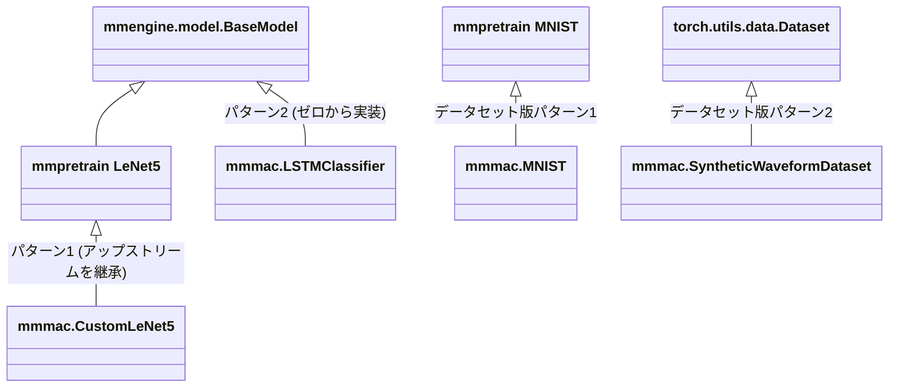

# Extending the Repository / リポジトリの拡張

## English

### Where new code goes

| You want to add | Put it in | Register into |
| --- | --- | --- |
| model / backbone / head | `mmmac/models/` | `mmmac.registry.MODELS` |
| dataset | `mmmac/datasets/` | `mmmac.registry.DATASETS` |
| transform | `mmmac/datasets/` | `mmmac.registry.TRANSFORMS` |
| metric | `mmmac/evaluation/metrics/` | `mmmac.registry.METRICS` |
| hook / loop / scheduler | `mmmac/engine/` | `mmmac.registry.HOOKS` etc. |
| visualizer / vis backend | `mmmac/visualization/` | `mmmac.registry.VISUALIZERS` etc. |

Rules:

1. Register with the decorator from `mmmac.registry` — never into an
   upstream registry directly.
2. Export the class from the sub-package's `__init__.py` (the registry's
   `locations` mechanism imports these modules lazily, so configs work
   without manual imports).
3. Reference it in configs as `type='mmmac.<ClassName>'`.
4. Add a mirror-located unit test under `tests/unit/`.

### Pattern 1 — extend an upstream model

`mmmac/models/backbones/lenet.py` is the reference implementation:

```python
from mmpretrain.models.backbones import LeNet5
from mmmac.registry import MODELS

@MODELS.register_module()
class CustomLeNet5(LeNet5):
    def forward(self, x):
        if x.shape[-2:] == (28, 28):
            x = F.pad(x, (2, 2, 2, 2))
        return super().forward(x)
```

The same pattern works for any library in the stack (`mmdet`, `mmseg`,
`mmdet3d`): import, subclass, register, then use
`type='mmmac.YourClass'` in a config. Datasets too — see
`mmmac/datasets/mnist.py`, which subclasses mmpretrain's MNIST just to fix
the download mirror.

### Pattern 2 — a brand-new (e.g. time-series) model

Tasks without an upstream library implement
`mmengine.model.BaseModel.forward(inputs, labels, mode)` directly; the
Runner, hooks, checkpointing and wandb logging all work unchanged.
`mmmac/models/temporal/lstm_classifier.py` +
`mmmac/datasets/time_series.py` + `configs/time_series/lstm_waveform.py`
form a complete working example.


Contract for `forward(inputs, labels, mode)`:

- `mode='loss'` → return `dict(loss=...)` (used by the train loop)
- `mode='predict'` → return a list of per-sample dicts
  (`pred_label`, `gt_label`), consumed by `mmmac.SimpleAccuracy`
- `mode='tensor'` → return raw logits (debugging / export)

For plain-tensor datasets, set
`collate_fn=dict(type='default_collate')` in the dataloader config (the
mmengine default `pseudo_collate` does not stack tensors).

### wandb integration

Already wired: `configs/_base_/vis_wandb.py` swaps the visualizer's
backends to `LocalVisBackend + WandbVisBackend`. Extend `init_kwargs`
(project, entity, tags, ...) there or per experiment. Custom
visualization backends belong in `mmmac/visualization/`.

---

## 日本語

### 新しいコードの置き場所

| 追加したいもの | 置き場所 | 登録先 |
| --- | --- | --- |
| モデル / バックボーン / ヘッド | `mmmac/models/` | `mmmac.registry.MODELS` |
| データセット | `mmmac/datasets/` | `mmmac.registry.DATASETS` |
| transform | `mmmac/datasets/` | `mmmac.registry.TRANSFORMS` |
| メトリクス | `mmmac/evaluation/metrics/` | `mmmac.registry.METRICS` |
| フック / ループ / スケジューラ | `mmmac/engine/` | `mmmac.registry.HOOKS` など |
| ビジュアライザ / vis backend | `mmmac/visualization/` | `mmmac.registry.VISUALIZERS` など |

規約:

1. 登録は必ず `mmmac.registry` のデコレータで行う — アップストリームの
   レジストリへ直接登録しない。
2. サブパッケージの `__init__.py` からクラスを export する(レジストリの
   `locations` 機構がこれらのモジュールを遅延 import するため、config は
   手動 import なしで動きます)。
3. config では `type='mmmac.<クラス名>'` で参照する。
4. `tests/unit/` のミラー位置にユニットテストを追加する。

### パターン 1 — アップストリームのモデルを拡張する

`mmmac/models/backbones/lenet.py` が参照実装です:

```python
from mmpretrain.models.backbones import LeNet5
from mmmac.registry import MODELS

@MODELS.register_module()
class CustomLeNet5(LeNet5):
    def forward(self, x):
        if x.shape[-2:] == (28, 28):
            x = F.pad(x, (2, 2, 2, 2))
        return super().forward(x)
```

同じパターンはスタック内のどのライブラリ(`mmdet`、`mmseg`、`mmdet3d`)
にも使えます: import → 継承 → 登録 → config で
`type='mmmac.YourClass'`。データセットも同様で、
`mmmac/datasets/mnist.py` は mmpretrain の MNIST を継承して
ダウンロードミラーだけを修正しています。

### パターン 2 — 完全に新規の(例: 時系列)モデル

アップストリームにライブラリがないタスクは、
`mmengine.model.BaseModel.forward(inputs, labels, mode)` を直接実装
します。Runner・フック・チェックポイント・wandb ロギングはそのまま
動作します。`mmmac/models/temporal/lstm_classifier.py` +
`mmmac/datasets/time_series.py` + `configs/time_series/lstm_waveform.py`
が完全な動作例です。



`forward(inputs, labels, mode)` の契約:

- `mode='loss'` → `dict(loss=...)` を返す(train ループが使用)
- `mode='predict'` → サンプルごとの dict(`pred_label`、`gt_label`)の
  リストを返す。`mmmac.SimpleAccuracy` が消費します
- `mode='tensor'` → 生の logits を返す(デバッグ / エクスポート用)

素のテンソルを返すデータセットでは、dataloader config に
`collate_fn=dict(type='default_collate')` を指定してください
(mmengine デフォルトの `pseudo_collate` はテンソルをスタックしません)。

### wandb 統合

すでに配線済みです: `configs/_base_/vis_wandb.py` がビジュアライザの
バックエンドを `LocalVisBackend + WandbVisBackend` に切り替えます。
`init_kwargs`(project、entity、tags など)はこのファイルまたは各実験
config で拡張してください。カスタム可視化バックエンドは
`mmmac/visualization/` に実装します。
