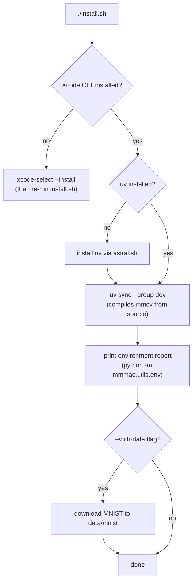
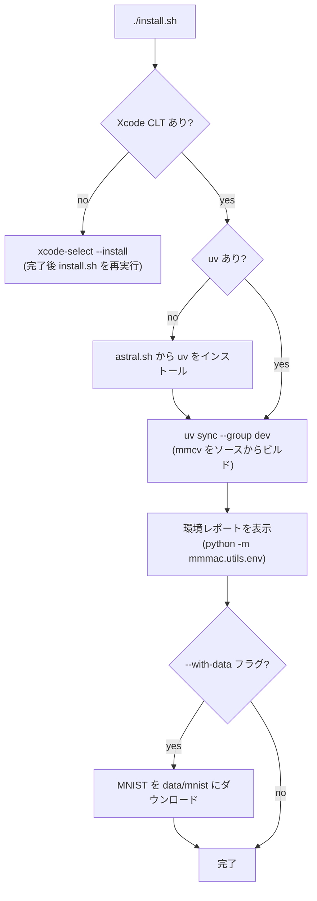

# Installation / インストール

## English

### Prerequisites

| Requirement | Why |
| --- | --- |
| macOS (Apple Silicon or Intel) | target platform of this repo |
| Xcode Command Line Tools | mmcv has no macOS wheel and is compiled from source |
| Internet access | package download + MNIST download |

`uv` and Python 3.11 are installed automatically by `install.sh` if missing.

### Quick start

```bash
./install.sh              # environment only
./install.sh --with-data  # environment + MNIST download
```

The script is idempotent — re-run it any time. The first run takes several
minutes because mmcv's C++ ops are compiled locally.



### Pinned versions and why

The OpenMMLab libraries have strict mutual version constraints. This repo
pins one known-good combination for macOS in `pyproject.toml` / `uv.lock`:

| Package | Version | Constraint it satisfies |
| --- | --- | --- |
| Python | 3.11 | supported by every package below |
| torch / torchvision | 2.1.2 / 0.16.2 | mmcv 2.1.0 compiles against its headers |
| numpy | < 2 | torch 2.1 is numpy-1.x only |
| mmengine | 0.10.x | required `< 1.0` by all mm* libs |
| mmcv | 2.1.0 | `< 2.2.0` required by mmdet / mmseg / mmdet3d |
| mmpretrain | 1.2.0 | accepts mmcv 2.1 |
| mmdet | 3.2.0 | `< 3.3.0` required by mmdet3d 1.4.0 |
| mmsegmentation | 1.2.2 | accepts mmcv 2.1 |
| mmdet3d | 1.4.0 | latest release compatible with the above |

Do not bump one of these in isolation — the set moves together.

### macOS build workarounds (encoded in this repo)

- **mmcv is built from source**: `[tool.uv.extra-build-dependencies]` in
  `pyproject.toml` injects `torch` and `setuptools<81` (for
  `pkg_resources`) into the isolated build environment.
- **`-Wno-invalid-specialization`**: torch 2.1 headers specialize
  `std::is_arithmetic`, which new Xcode/clang (libc++ ≥ 17) rejects as an
  error. `install.sh` exports this flag in `CFLAGS`/`CXXFLAGS`; older clang
  ignores it. Without it the mmcv build fails with
  `'is_arithmetic' cannot be specialized`.
- **No CUDA / NCCL**: `configs/_base_/default_runtime.py` uses the `gloo`
  backend and single-process dataloaders (`num_workers=0`). Apple GPU (MPS)
  is used automatically when available.

### Verifying the installation

```bash
uv run python -m mmmac.utils.env   # versions + MPS availability
uv run pytest tests/unit -q        # fast sanity check
```

---

## 日本語

### 事前準備

| 要件 | 理由 |
| --- | --- |
| macOS (Apple Silicon または Intel) | 本リポジトリのターゲットプラットフォーム |
| Xcode Command Line Tools | mmcv に macOS 用 wheel がなく、ソースからビルドするため |
| インターネット接続 | パッケージ取得 + MNIST ダウンロード |

`uv` と Python 3.11 は、未インストールなら `install.sh` が自動で導入します。

### クイックスタート

```bash
./install.sh              # 環境構築のみ
./install.sh --with-data  # 環境構築 + MNIST ダウンロード
```

スクリプトは冪等で、何度実行しても安全です。初回は mmcv の C++
オペレータをローカルでコンパイルするため数分かかります。



### バージョン固定とその理由

OpenMMLab 各ライブラリは相互のバージョン制約が厳しいため、macOS で動作
確認済みの組み合わせを `pyproject.toml` / `uv.lock` で固定しています:

| パッケージ | バージョン | 満たしている制約 |
| --- | --- | --- |
| Python | 3.11 | 以下すべてのパッケージがサポート |
| torch / torchvision | 2.1.2 / 0.16.2 | mmcv 2.1.0 がこのヘッダに対してコンパイルされる |
| numpy | < 2 | torch 2.1 は numpy 1.x のみ対応 |
| mmengine | 0.10.x | 全 mm* ライブラリが `< 1.0` を要求 |
| mmcv | 2.1.0 | mmdet / mmseg / mmdet3d が `< 2.2.0` を要求 |
| mmpretrain | 1.2.0 | mmcv 2.1 に対応 |
| mmdet | 3.2.0 | mmdet3d 1.4.0 が `< 3.3.0` を要求 |
| mmsegmentation | 1.2.2 | mmcv 2.1 に対応 |
| mmdet3d | 1.4.0 | 上記と互換のある最新リリース |

単独でのバージョン更新は避けてください — このセットは連動して動きます。

### macOS 向けビルド対策(本リポジトリに組み込み済み)

- **mmcv のソースビルド**: `pyproject.toml` の
  `[tool.uv.extra-build-dependencies]` で、隔離ビルド環境に `torch` と
  `setuptools<81`(`pkg_resources` 用)を注入しています。
- **`-Wno-invalid-specialization`**: torch 2.1 のヘッダは
  `std::is_arithmetic` を特殊化しており、新しい Xcode/clang (libc++ ≥ 17)
  はこれをエラーにします。`install.sh` がこのフラグを
  `CFLAGS`/`CXXFLAGS` に設定します(古い clang では無視されます)。
  このフラグなしでは mmcv ビルドが
  `'is_arithmetic' cannot be specialized` で失敗します。
- **CUDA / NCCL なし**: `configs/_base_/default_runtime.py` は `gloo`
  バックエンドとシングルプロセスのデータローダ(`num_workers=0`)を使用。
  Apple GPU (MPS) は利用可能なら自動で使われます。

### インストールの確認

```bash
uv run python -m mmmac.utils.env   # バージョン + MPS 利用可否
uv run pytest tests/unit -q        # 高速サニティチェック
```
