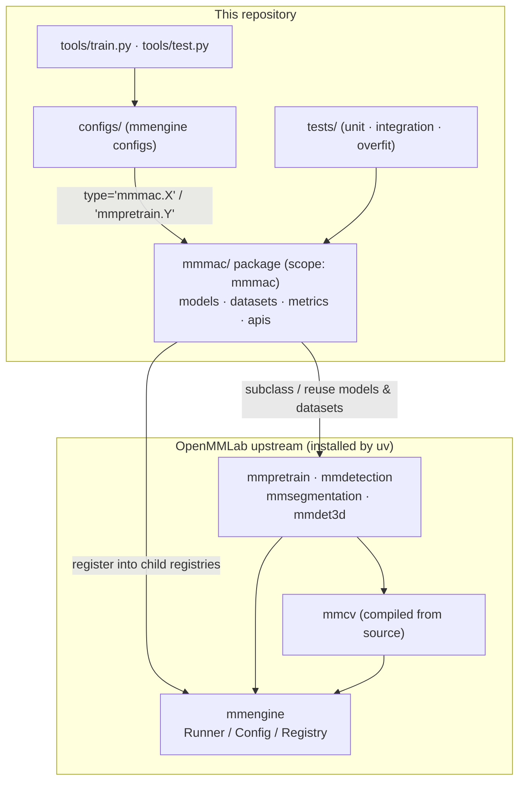
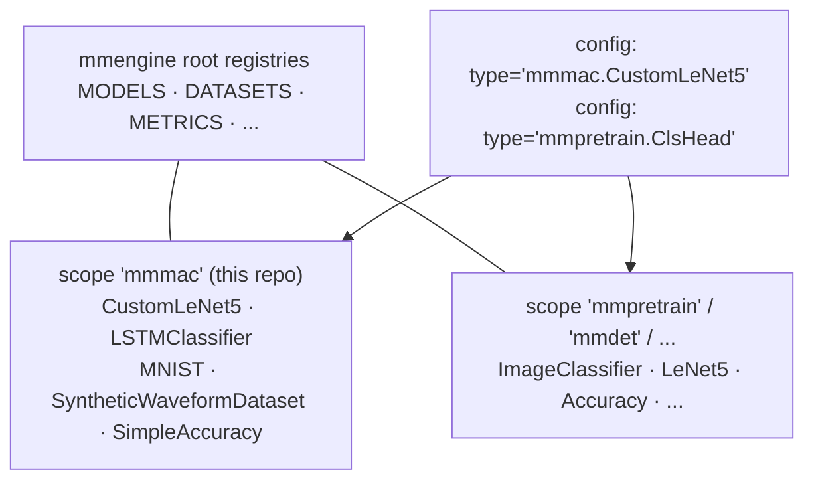
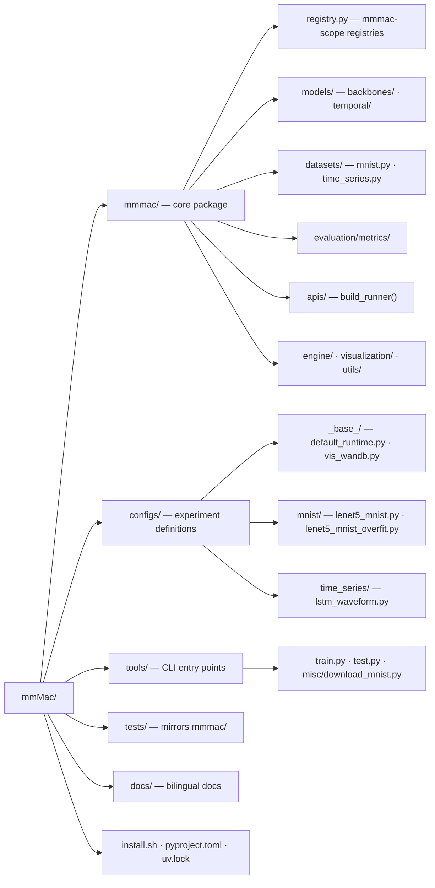
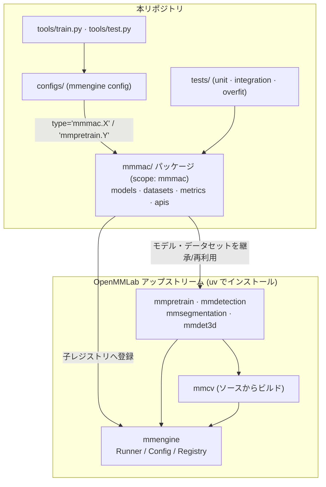
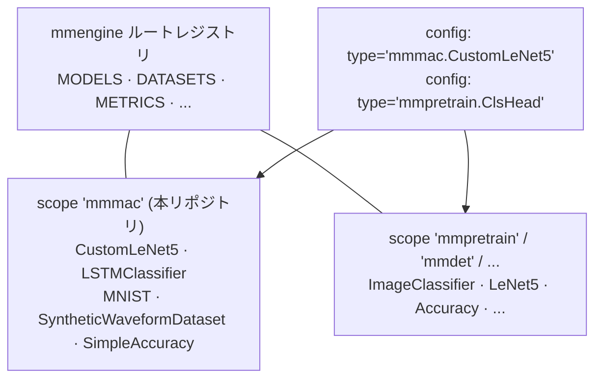
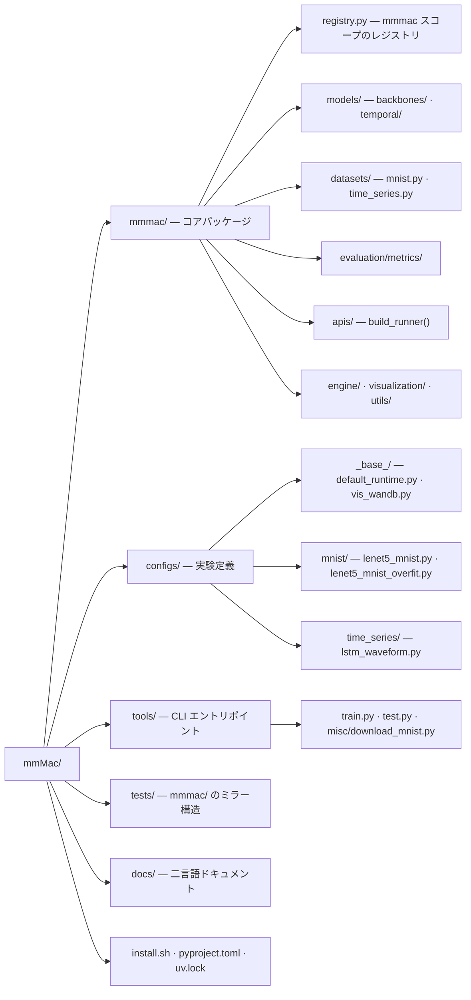

# Overview / 概要

## English

### What is this repository?

`mmmac` is a training / evaluation playground for machine-learning models
that runs natively on macOS (Apple Silicon), built on the OpenMMLab stack:

- **mmengine** — Runner, Config, Registry, hooks (the execution engine)
- **mmcv** — compiled CPU ops + transforms (built from source on macOS)
- **mmpretrain / mmdetection / mmsegmentation / mmdet3d** — model zoos,
  importable as Python modules and extendable from this repo

All original code lives in the `mmmac/` package under its own registry
scope `mmmac`. Experiments are described by mmengine configs in `configs/`
and executed through `tools/train.py` / `tools/test.py`.

### Architecture



### Registry design

Every registry in `mmmac/registry.py` is a **child of the corresponding
mmengine root registry** with scope `mmmac`. Configs set
`default_scope = 'mmmac'` and reference components with explicit scope
prefixes, so it is always unambiguous where a class comes from:



### Repository layout



```
mmMac/
├── install.sh              # one-shot environment setup
├── pyproject.toml          # uv-managed, fully pinned dependency set
├── mmmac/                  # ★ all core code lives here
│   ├── registry.py         # mmmac-scope registries (children of mmengine)
│   ├── apis/runner.py      # build_runner(cfg) used by tools & tests
│   ├── models/backbones/   # CustomLeNet5 (extends mmpretrain LeNet5)
│   ├── models/temporal/    # LSTMClassifier (time-series example)
│   ├── datasets/           # MNIST (mirror fix), SyntheticWaveformDataset
│   ├── evaluation/metrics/ # SimpleAccuracy
│   ├── engine/             # custom hooks/loops (placeholder)
│   └── visualization/      # custom visualizers (placeholder)
├── configs/                # mmengine configs (see docs/training_and_testing.md)
├── tools/                  # train.py / test.py / misc/
├── tests/                  # unit / integration / overfit — mirrors mmmac/
├── docs/                   # this documentation (EN + JA)
├── data/                   # datasets (gitignored)
└── work_dirs/              # logs & checkpoints (gitignored)
```

---

## 日本語

### このリポジトリは何か

`mmmac` は、macOS (Apple Silicon) 上でネイティブに動作する、OpenMMLab
スタックベースの機械学習モデル学習・評価リポジトリです:

- **mmengine** — Runner・Config・Registry・フック(実行エンジン)
- **mmcv** — コンパイル済み CPU オペレータ + transforms(macOS ではソースからビルド)
- **mmpretrain / mmdetection / mmsegmentation / mmdet3d** — モデル群。
  Python モジュールとして import し、本リポジトリから拡張して利用します

独自コードはすべて `mmmac/` パッケージに置かれ、専用のレジストリスコープ
`mmmac` を持ちます。実験は `configs/` の mmengine config で定義し、
`tools/train.py` / `tools/test.py` から実行します。

### アーキテクチャ



### レジストリ設計

`mmmac/registry.py` の各レジストリは、**mmengine のルートレジストリの
子**としてスコープ `mmmac` で定義されています。config では
`default_scope = 'mmmac'` を設定し、コンポーネントは明示的なスコープ
プレフィックス付きで参照するため、クラスの出所が常に明確です:



### ディレクトリ構成



```
mmMac/
├── install.sh              # 環境構築ワンショットスクリプト
├── pyproject.toml          # uv 管理・全依存バージョン固定
├── mmmac/                  # ★ コアコードはすべてここ
│   ├── registry.py         # mmmac スコープのレジストリ (mmengine の子)
│   ├── apis/runner.py      # tools とテストが使う build_runner(cfg)
│   ├── models/backbones/   # CustomLeNet5 (mmpretrain LeNet5 を継承)
│   ├── models/temporal/    # LSTMClassifier (時系列モデルの例)
│   ├── datasets/           # MNIST (ミラー修正版), SyntheticWaveformDataset
│   ├── evaluation/metrics/ # SimpleAccuracy
│   ├── engine/             # カスタムフック/ループ (プレースホルダ)
│   └── visualization/      # カスタム可視化 (プレースホルダ)
├── configs/                # mmengine config (docs/training_and_testing.md 参照)
├── tools/                  # train.py / test.py / misc/
├── tests/                  # unit / integration / overfit — mmmac/ のミラー
├── docs/                   # 本ドキュメント (英語 + 日本語)
├── data/                   # データセット (gitignore 対象)
└── work_dirs/              # ログ・チェックポイント (gitignore 対象)
```
