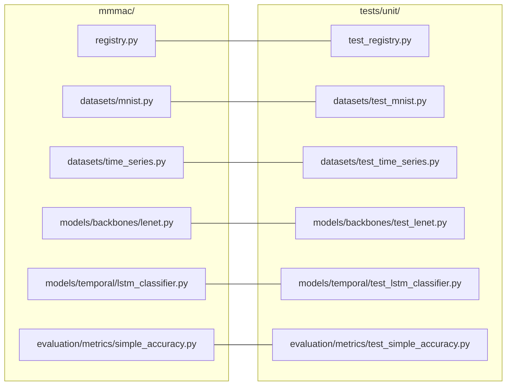
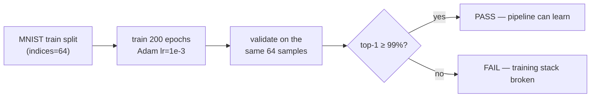
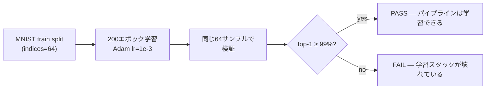

# Testing / テスト

## English

### Test taxonomy

| Layer | Directory | Scope | Data | Typical runtime |
| --- | --- | --- | --- | --- |
| unit | `tests/unit/` | one class / function | none | seconds |
| integration | `tests/integration/` | Runner + CLI end-to-end | synthetic | ~30 s |
| overfit | `tests/overfit/` | "can the repo actually learn?" | MNIST (auto-download, ~11 MB) | ~1 min |

```bash
uv run pytest tests/unit -q            # fast feedback
uv run pytest tests/integration -q     # Runner + tools/*.py
uv run pytest tests/overfit -q         # MNIST overfit sanity check
uv run pytest -q                       # everything
uv run pytest -q -m "not overfit"      # skip the download-dependent test
```

### Mirror structure

`tests/unit/` mirrors the `mmmac/` package one-to-one — when you add
`mmmac/<path>/<file>.py`, add `tests/unit/<path>/test_<file>.py`:



### The overfit test

`tests/overfit/test_mnist_overfit.py` trains
`configs/mnist/lenet5_mnist_overfit.py`: LeNet5 on the **first 64 MNIST
training images**, validated on those same 64 images. A healthy training
stack memorizes them; the test asserts **top-1 ≥ 99%** (it reaches 100%
within 50 epochs in practice). If this test fails, something fundamental
is broken — config loading, registry resolution, the data pipeline, the
optimizer step, or the val loop.



### Conventions

- Every test writes only to pytest's `tmp_path`; MNIST is cached in
  `data/mnist` (gitignored) so the download happens once.
- Long tests carry `@pytest.mark.timeout(...)` so a hang fails fast.
- Markers `integration` / `overfit` are declared in `pyproject.toml`.

---

## 日本語

### テスト分類

| 層 | ディレクトリ | 対象 | データ | 実行時間目安 |
| --- | --- | --- | --- | --- |
| unit | `tests/unit/` | 単一クラス / 関数 | なし | 数秒 |
| integration | `tests/integration/` | Runner + CLI のエンドツーエンド | 合成データ | 約30秒 |
| overfit | `tests/overfit/` | 「本当に学習できるか?」 | MNIST (自動DL、約11MB) | 約1分 |

```bash
uv run pytest tests/unit -q            # 高速フィードバック
uv run pytest tests/integration -q     # Runner + tools/*.py
uv run pytest tests/overfit -q         # MNIST 過学習サニティチェック
uv run pytest -q                       # 全部
uv run pytest -q -m "not overfit"      # ダウンロード依存テストを除外
```

### ミラー構造

`tests/unit/` は `mmmac/` パッケージと 1 対 1 で対応します。
`mmmac/<path>/<file>.py` を追加したら
`tests/unit/<path>/test_<file>.py` を追加してください:


### overfit テスト

`tests/overfit/test_mnist_overfit.py` は
`configs/mnist/lenet5_mnist_overfit.py` を学習します: LeNet5 を
**MNIST 学習データの先頭 64 枚**で学習し、同じ 64 枚で検証します。
健全な学習スタックならこれを記憶できるはずで、テストは
**top-1 ≥ 99%** をアサートします(実際には 50 エポック以内に 100% に
到達)。このテストが落ちる場合、config 読み込み・レジストリ解決・
データパイプライン・オプティマイザ・val ループのいずれか根本的な部分が
壊れています。



### 規約

- すべてのテストは pytest の `tmp_path` のみに書き込みます。MNIST は
  `data/mnist`(gitignore 対象)にキャッシュされ、ダウンロードは 1 回
  だけ行われます。
- 長時間テストには `@pytest.mark.timeout(...)` を付け、ハングを早期に
  検出します。
- マーカー `integration` / `overfit` は `pyproject.toml` で宣言済みです。
