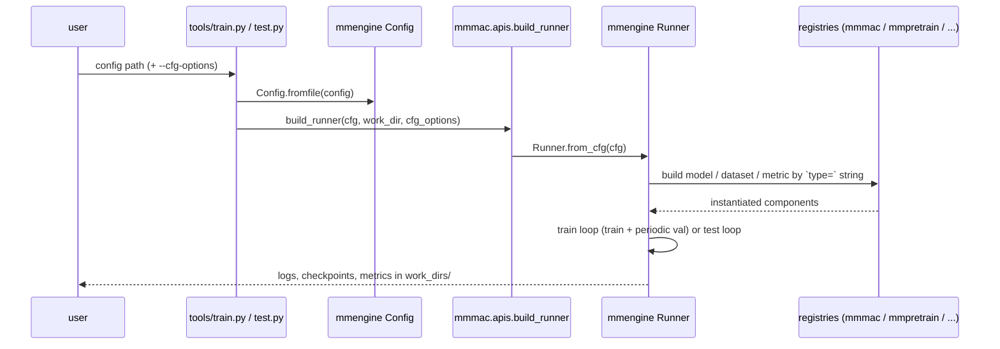
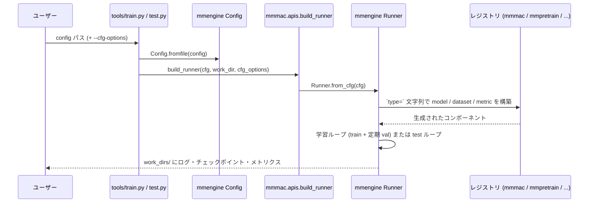

# Training & Testing / 学習と評価

## English

### Entry points

All experiments run through two CLIs, which are thin wrappers around
`mmmac.apis.build_runner()` → `mmengine.runner.Runner`:

```bash
# train (work dir defaults to work_dirs/<config stem>)
uv run python tools/train.py configs/mnist/lenet5_mnist.py

# resume from the latest checkpoint in the work dir
uv run python tools/train.py configs/mnist/lenet5_mnist.py --resume

# override any config entry from the command line
uv run python tools/train.py configs/mnist/lenet5_mnist.py \
    --cfg-options train_cfg.max_epochs=10 optim_wrapper.optimizer.lr=0.1

# evaluate a checkpoint with the test dataloader
uv run python tools/test.py configs/mnist/lenet5_mnist.py \
    work_dirs/lenet5_mnist/epoch_5.pth
```



### Available configs

| Config | Task | Notes |
| --- | --- | --- |
| `configs/mnist/lenet5_mnist.py` | MNIST 10-class classification | reference recipe; auto-downloads MNIST |
| `configs/mnist/lenet5_mnist_overfit.py` | overfit 64 MNIST samples | sanity check, reaches 100% top-1 (~1 min) |
| `configs/time_series/lstm_waveform.py` | 3-class waveform classification | time-series example, no download needed |

### Config conventions

- Every experiment inherits `configs/_base_/default_runtime.py`
  (`default_scope='mmmac'`, macOS-safe env settings).
- Cross-library components always use explicit scope prefixes:
  `type='mmmac.CustomLeNet5'`, `type='mmpretrain.ClsHead'`. This makes the
  origin of every class obvious and avoids scope-resolution surprises.
- Outputs go to `work_dirs/<config stem>/` (gitignored).

### Where outputs go

Each run writes to `work_dirs/<config stem>/` (or `--work-dir`):

```
work_dirs/lenet5_mnist/
├── epoch_N.pth                  # checkpoints (CheckpointHook)
├── last_checkpoint
└── <timestamp>/
    ├── <timestamp>.log          # full text log
    └── vis_data/                # LocalVisBackend storage
        ├── config.py            # frozen config of the run
        └── scalars.json         # every logged scalar (loss, accuracy, lr)
```

**Note:** when a config is run through pytest (e.g. `tests/overfit/`),
`work_dir` is pytest's `tmp_path`
(`/private/var/.../pytest-of-<user>/…`), which pytest garbage-collects —
run the config via `tools/train.py` if you want to keep the outputs.

---

## 日本語

### エントリポイント

すべての実験は 2 つの CLI から実行します。どちらも
`mmmac.apis.build_runner()` → `mmengine.runner.Runner` の薄いラッパーです:

```bash
# 学習 (work dir のデフォルトは work_dirs/<config名>)
uv run python tools/train.py configs/mnist/lenet5_mnist.py

# work dir 内の最新チェックポイントから再開
uv run python tools/train.py configs/mnist/lenet5_mnist.py --resume

# config の任意の項目をコマンドラインから上書き
uv run python tools/train.py configs/mnist/lenet5_mnist.py \
    --cfg-options train_cfg.max_epochs=10 optim_wrapper.optimizer.lr=0.1

# チェックポイントを test dataloader で評価
uv run python tools/test.py configs/mnist/lenet5_mnist.py \
    work_dirs/lenet5_mnist/epoch_5.pth
```



### 利用可能な config

| Config | タスク | 備考 |
| --- | --- | --- |
| `configs/mnist/lenet5_mnist.py` | MNIST 10クラス分類 | 標準レシピ。MNIST は自動ダウンロード |
| `configs/mnist/lenet5_mnist_overfit.py` | MNIST 64 サンプルへの過学習 | サニティチェック。top-1 100% に到達 (約1分) |
| `configs/time_series/lstm_waveform.py` | 波形 3クラス分類 | 時系列の例。ダウンロード不要 |

### config の規約

- すべての実験は `configs/_base_/default_runtime.py` を継承します
  (`default_scope='mmmac'`、macOS 向けの安全な環境設定)。
- ライブラリをまたぐコンポーネントは常に明示的なスコーププレフィックスを
  使います: `type='mmmac.CustomLeNet5'`、`type='mmpretrain.ClsHead'`。
  クラスの出所が明確になり、スコープ解決の事故を防ぎます。
- 出力は `work_dirs/<config名>/` に保存されます (gitignore 対象)。

### 出力先

各実行は `work_dirs/<config名>/`(または `--work-dir`)に書き込みます:

```
work_dirs/lenet5_mnist/
├── epoch_N.pth                  # チェックポイント (CheckpointHook)
├── last_checkpoint
└── <タイムスタンプ>/
    ├── <タイムスタンプ>.log      # テキストログ全文
    └── vis_data/                # LocalVisBackend の保存先
        ├── config.py            # 実行時の config スナップショット
        └── scalars.json         # 記録された全スカラー (loss, accuracy, lr)
```

**注意:** config を pytest 経由(`tests/overfit/` など)で実行した場合、
`work_dir` は pytest の `tmp_path`
(`/private/var/.../pytest-of-<ユーザー>/…`)になり、pytest が自動削除
します。出力を残したい場合は `tools/train.py` から実行してください。
